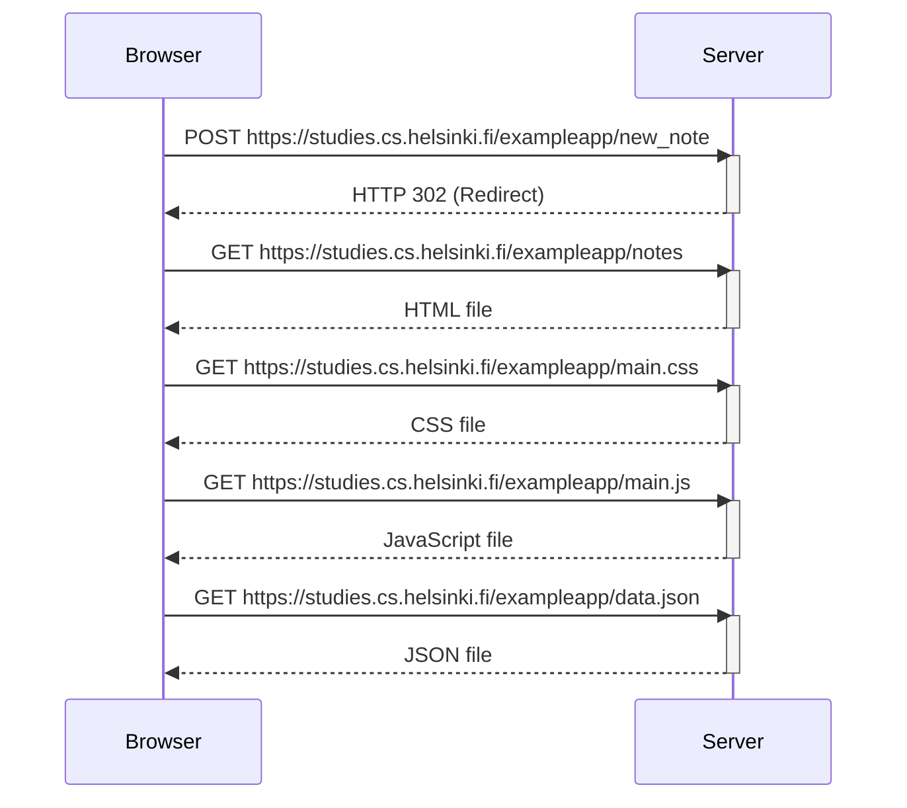

```mermaid
sequenceDiagram
  participant Browser
  participant Server

  Browser->>Server: POST https://studies.cs.helsinki.fi/exampleapp/new_note
  activate Server
  Server-->>Browser: HTTP 302 (Redirect)
  deactivate Server
  
  Browser->>Server: GET https://studies.cs.helsinki.fi/exampleapp/notes
  activate Server
  Server-->>Browser: HTML file
  deactivate Server
  
  Browser->>Server: GET https://studies.cs.helsinki.fi/exampleapp/main.css
  activate Server
  Server-->>Browser: CSS file
  deactivate Server
  
  Browser->>Server: GET https://studies.cs.helsinki.fi/exampleapp/main.js
  activate Server
  Server-->>Browser: JavaScript file
  deactivate Server
  
  Browser->>Server: GET https://studies.cs.helsinki.fi/exampleapp/data.json
  activate Server
  Server-->>Browser: JSON file
  deactivate Server 
```