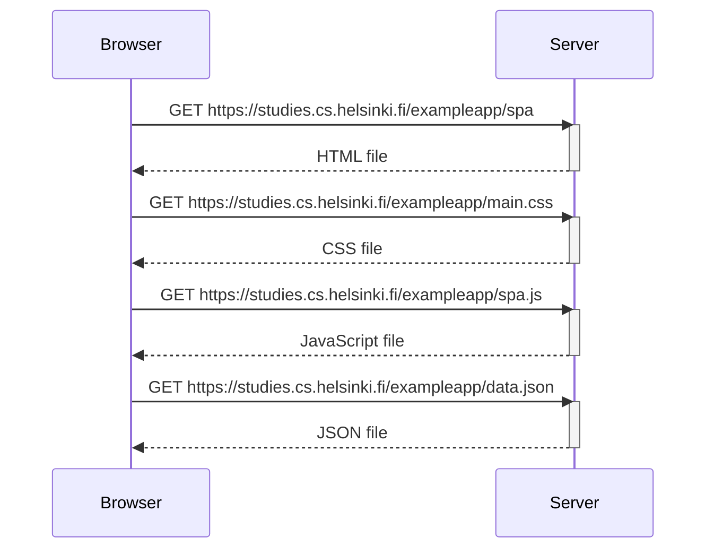

```mermaid
sequenceDiagram
  participant Browser
  participant Server
  
  Browser->>Server: GET https://studies.cs.helsinki.fi/exampleapp/spa
  activate Server
  Server-->>Browser: HTML file
  deactivate Server
  
  Browser->>Server: GET https://studies.cs.helsinki.fi/exampleapp/main.css
  activate Server
  Server-->>Browser: CSS file
  deactivate Server
  
  Browser->>Server: GET https://studies.cs.helsinki.fi/exampleapp/spa.js
  activate Server
  Server-->>Browser: JavaScript file
  deactivate Server
  
  Browser->>Server: GET https://studies.cs.helsinki.fi/exampleapp/data.json
  activate Server
  Server-->>Browser: JSON file
  deactivate Server 
```